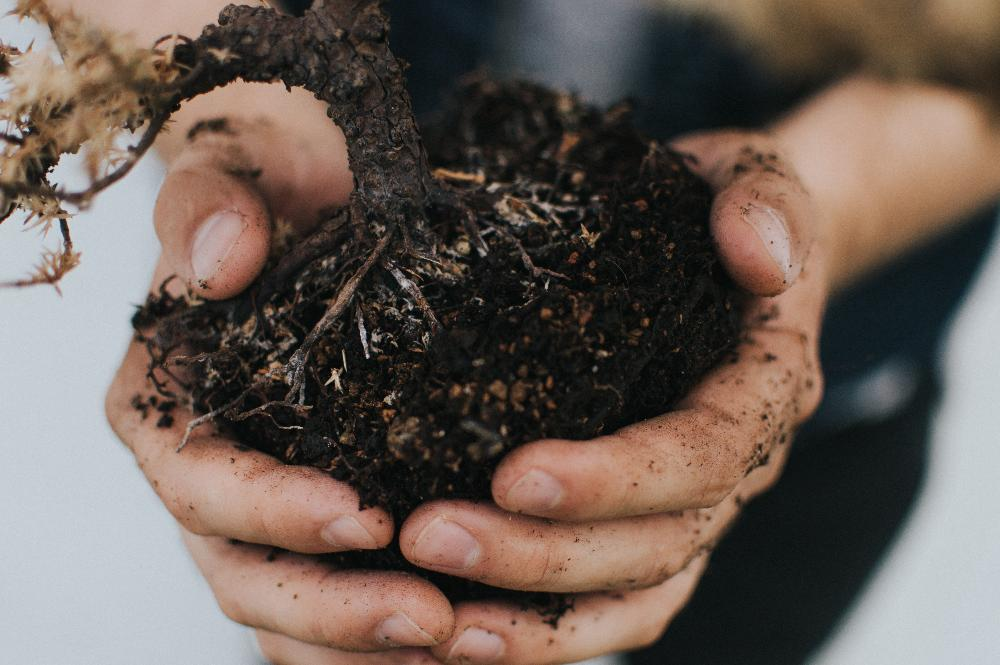
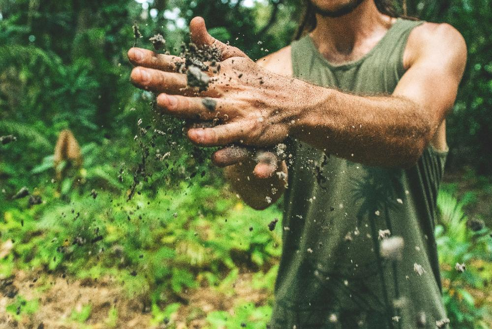
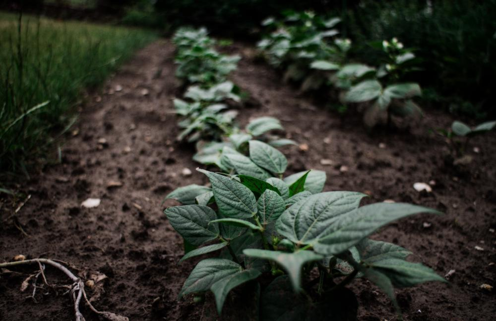
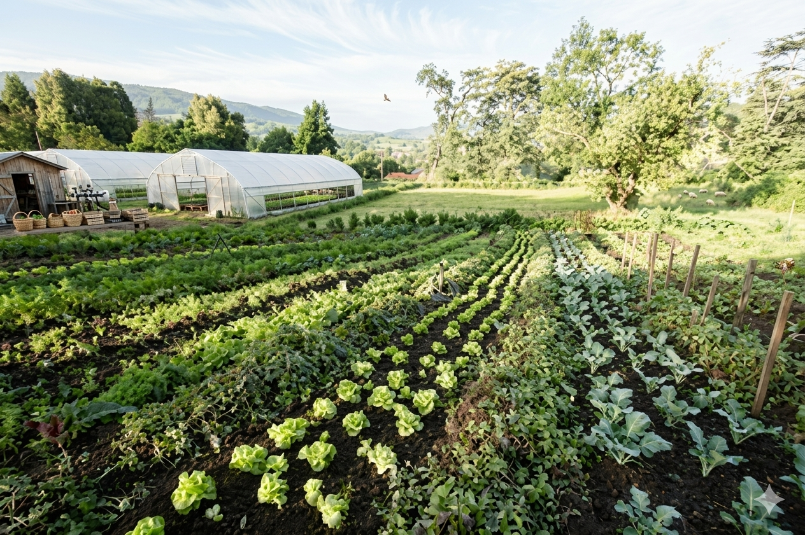

  
Este proyecto consiste en generar pequeñas granjas unifamiliares nucleadas en una colonia. Tiene como finalidad brindar a individuos que viven en condición de pobreza en Argentina y que estén dispuestos a trabajar, la posibilidad de salir de esa situación realizando un emprendimiento para sí mismo y su familia del cual será su titular y responsable.

  

    
    

      <h3>Trabajo Sustentable</h3>
      
Impulsando emprendimientos que respetan y valoran nuestro entorno.

    

  

  

    
    

      <h3>Producción Local</h3>
      
Fomentando el crecimiento y desarrollo económico familiar mediante granjas propias.

    

  

  

    
    

      <h3>Crecimiento Familiar</h3>
      
Creando oportunidades reales de progreso a través de la formación y el esfuerzo conjunto.

    

  

<h2 class="page-title">Proyectos Destacados</h2>

  <h3>Taller de Armado de Colector Solar</h3>
  
<strong>Mayo del 2019 - Colegio Perito Moreno de Martinez.</strong> 
  Organizado por Manos a la Tierra y dictado por investigadores del IIPAC (Univ. Nacional de La Plata- CONICET).

  
  

    <iframe src="//www.youtube.com/embed/nsxP-wpa9zQ?&wmode=transparent&rel=0" allowfullscreen="true" width="590" height="344" frameborder="0" style="max-width: 100%; border-radius: var(--radius-md); box-shadow: 0 4px 15px rgba(0,0,0,0.1);"></iframe>
  

  <h3>Huertas Familiares en Boulogne</h3>
  
Analizando el terreno para el proyecto y trabajando en la huerta junto a la comunidad para asegurar un futuro más verde y próspero.

  

    <!-- Placeholder for gallery images, ideally replacing the old carousel -->
    
  

